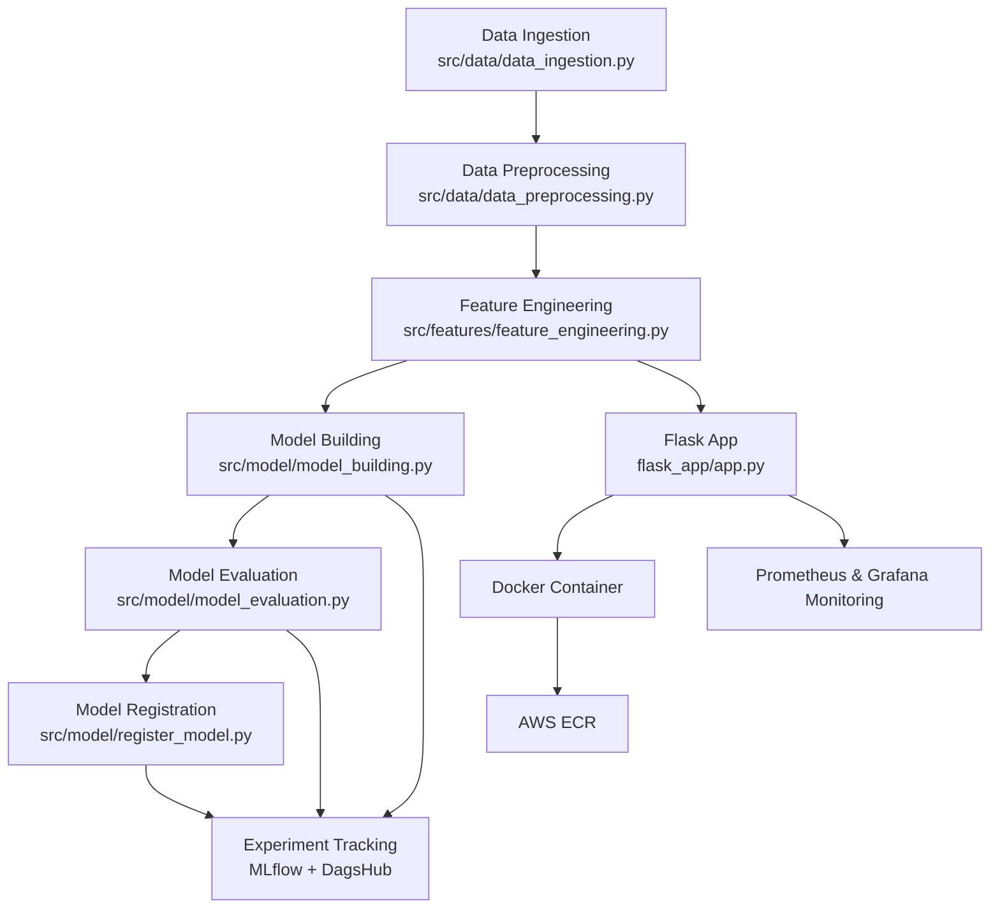

# Automate MLOps Lifecycle: IMDB Sentiment Analysis

Welcome to the **Automate MLOps Lifecycle** project! This repository demonstrates a full MLOps workflow for text sentiment classification using the IMDB dataset, with robust experiment tracking, CI/CD, containerization, cloud deployment, and production-grade monitoring with Prometheus and Grafana.

---

## 🚀 Project Overview

- **Goal:** Predict sentiment (positive/negative) from IMDB movie reviews.
- **Tech Stack:** Python, scikit-learn, pandas, NLTK, Flask, MLflow, DagsHub, DVC, Docker, GitHub Actions, AWS ECR, **Prometheus, Grafana**.
- **MLOps:** Automated data versioning, experiment tracking, model registry, CI/CD, containerized deployment, and monitoring with dashboards.

---

## 📂 Project Structure

```
.
├── src/
│   ├── data/
│   │   ├── data_ingestion.py
│   │   └── data_preprocessing.py
│   ├── features/
│   │   └── feature_engineering.py
│   ├── model/
│   │   ├── model_building.py
│   │   ├── model_evaluation.py
│   │   ├── register_model.py
│   │   └── ...
│   ├── logger/
│   └── ...
├── flask_app/
│   ├── app.py
│   ├── requirements.txt
│   └── templates/
│       └── index.html
├── models/
│   └── vectorizer.pkl
├── data/
│   └── (raw/interim/processed data - DVC tracked)
├── reports/
│   ├── metrics.json
│   ├── experiment_info.json
│   └── figures/
├── tests/
│   ├── test_model.py
│   └── test_flask_app.py
├── scripts/
│   └── promote_model.py
├── dvc.yaml
├── params.yaml
├── requirements.txt
├── dockerfile
├── .gitignore
├── .github/workflows/mlcicd.yaml
└── README.md
```

---

## ⚙️ End-to-End MLOps Workflow

### 1. **Data Ingestion & Preprocessing**
- Download and split IMDB data.
- Clean and normalize text (lowercase, remove stopwords, lemmatize, etc.).
- Scripts: `src/data/data_ingestion.py`, `src/data/data_preprocessing.py`

### 2. **Feature Engineering**
- Transform text using Bag-of-Words or TF-IDF.
- Save vectorizer for inference.
- Script: `src/features/feature_engineering.py`

### 3. **Model Building & Evaluation**
- Train ML models (e.g., Logistic Regression).
- Evaluate with metrics (accuracy, precision, recall, AUC).
- Log metrics and models to MLflow (DagsHub backend).
- Scripts: `src/model/model_building.py`, `src/model/model_evaluation.py`

### 4. **Model Registration**
- Register the best model to MLflow Model Registry on DagsHub.
- Script: `src/model/register_model.py`

### 5. **Flask App for Inference**
- REST API for sentiment prediction.
- Loads model and vectorizer from artifacts.
- **Monitors with Prometheus metrics.**
- App: `flask_app/app.py`

### 6. **Testing**
- Unit tests for model and Flask app.
- Directory: `tests/`

### 7. **CI/CD Pipeline**
- Automated with GitHub Actions:
  - Runs DVC pipeline, tests, model promotion, and containerization.
  - Pushes Docker image to AWS ECR.
- Workflow: `.github/workflows/mlcicd.yaml`

### 8. **Containerization**
- Dockerfile builds a lightweight image for the Flask app.
- Supports both development and production (Gunicorn) runs.

### 9. **Monitoring & Dashboarding**
- **Prometheus** scrapes metrics from the Flask app (e.g., request count, latency, error rate).
- **Grafana** visualizes these metrics with custom dashboards for real-time monitoring of model and API health.
- See [Monitoring & Dashboarding](#-monitoring--dashboarding-with-prometheus--grafana) for setup and example dashboards.

---

## 🛠️ Key Features

- **Data Versioning:** DVC tracks all data and model artifacts.
- **Experiment Tracking:** MLflow logs all runs, metrics, and artifacts to DagsHub.
- **Model Registry:** Models are versioned and promoted via MLflow Model Registry.
- **CI/CD:** GitHub Actions automates testing, model promotion, and Docker builds.
- **Cloud Deployment:** Docker images are pushed to AWS ECR for scalable deployment.
- **Monitoring:** Prometheus metrics for app and model monitoring, visualized in Grafana dashboards.
- **Reproducibility:** All parameters tracked in `params.yaml` and DVC pipeline.

---

## 📈 Example Experiment Visualizations

### Experiment 1: Hyperparameter Tuning


### Experiment 2: Algorithm Comparison


### Experiment 3: Feature Engineering Impact


---

## 🖥️ Monitoring & Dashboarding with Prometheus & Grafana

### **Prometheus Integration**
- The Flask app exposes a `/metrics` endpoint compatible with Prometheus.
- Prometheus is configured to scrape metrics from the Flask app (request count, latency, error rate, etc.).
- Example Prometheus scrape config:
    ```yaml
    scrape_configs:
      - job_name: "flask-app"
        static_configs:
          - targets: ["<your-flask-app-host>:5000"]
    ```

### **Grafana Dashboards**
- Grafana connects to Prometheus as a data source.
- Custom dashboards visualize:
  - API request rates
  - Latency and response times
  - Error rates
  - Model prediction statistics

#### **Sample Dashboard**


### **Setup Steps**
1. **Install Prometheus and Grafana** on your server or cloud instance.
2. **Configure Prometheus** with the correct `prometheus.yml` (see above).
3. **Start Prometheus and Grafana** services.
4. **Add Prometheus as a data source** in Grafana.
5. **Import or create dashboards** to visualize your metrics.

---

## 🐳 Docker & Deployment

**Build and run locally:**
```sh
docker build -t imdb-mlops:latest .
docker run -p 8888:5000 -e DAGSHUB_TOKEN=<your_token> imdb-mlops:latest
```

**Production run (uncomment Gunicorn CMD in Dockerfile):**
```dockerfile
# CMD ["gunicorn", "-b", "0.0.0.0:5000", "--timeout", "120", "app:app"]
```

---

## 🚦 CI/CD Pipeline (GitHub Actions)

- **project-testing job:**  
  - Checks out code, installs dependencies, runs DVC pipeline, tests, and uploads build context as an artifact.
- **Containerize job:**  
  - Downloads artifact, builds Docker image, logs in to AWS ECR, and pushes the image.

**Secrets required:**
- `DAGSHUB_TOKEN` (as `TEST_ENV`)
- `AWS_ACCESS_KEY_ID`, `AWS_SECRET_ACCESS_KEY`, `AWS_REGION`, `ECR_REPOSITORY`, `AWS_ACCOUNT_ID`

---

## 📦 DVC Pipeline

- **dvc.yaml** defines all stages: data-ingestion, data-preprocessing, feature-engineering, model-building, model-evaluation, model-registration.
- **params.yaml** tracks all key parameters (e.g., `test_size`, `max_features`).

---

## 📝 How to Reproduce

1. **Clone the repo**
   ```sh
   git clone https://github.com/Pratik-Kaware/automate-mlops-lifecycle.git
   cd automate-mlops-lifecycle
   ```

2. **Set up environment**
   ```sh
   conda create -n atlas311 python=3.11
   conda activate atlas311
   pip install -r requirements.txt
   ```

3. **Configure DVC and MLflow**
   - Set up DagsHub and AWS credentials as described above.

4. **Run DVC pipeline**
   ```sh
   dvc repro
   ```

5. **Run Flask app locally**
   ```sh
   cd flask_app
   python app.py
   ```

6. **Run tests**
   ```sh
   python -m unittest tests/test_model.py
   python -m unittest tests/test_flask_app.py
   ```

7. **Build and run Docker image**
   ```sh
   docker build -t imdb-mlops:latest .
   docker run -p 8888:5000 -e DAGSHUB_TOKEN=<your_token> imdb-mlops:latest
   ```

8. **Set up Monitoring (Prometheus & Grafana)**
   - Install Prometheus and Grafana.
   - Configure Prometheus to scrape the Flask app.
   - Add Prometheus as a data source in Grafana and import dashboards.

---

## 📊 MLOps Lifecycle Diagram



---

## 🐞 Debugging & Troubleshooting Guide

When deploying to Kubernetes, we used the following systematic debug approach:

1. **Check Pod Status:**  
   Use `kubectl get pods` and `kubectl describe pod <pod-name>` to identify scheduling or crash issues.

2. **Inspect Pod Logs:**  
   Run `kubectl logs <pod-name>` to view application errors and stack traces.

3. **Verify Environment Variables:**  
   Ensure all required environment variables (like `DAGSHUB_TOKEN`) are set in your deployment manifest and correctly mapped from Kubernetes secrets.

4. **Check Secret Mapping:**  
   Make sure the secret key in Kubernetes matches the environment variable expected by your app.  
   Example:  
   ```yaml
   env:
     - name: DAGSHUB_TOKEN
       valueFrom:
         secretKeyRef:
           name: test-env
           key: DAGSHUB_TOKEN
   ```

5. **Update or Create Secrets:**  
   Use the following command to create/update the secret with the correct key:
   ```sh
   kubectl create secret generic test-env \
     --from-literal=DAGSHUB_TOKEN=<your_token> --dry-run=client -o yaml | kubectl apply -f -
   ```

6. **Redeploy and Monitor:**  
   After making changes, re-apply your deployment and monitor pod status and logs.

---

**Tip:**  
Always align your secret keys and environment variable names between your CI/CD pipeline, Kubernetes secrets, and your application code

## 🤝 Contributing

Contributions, issues, and feature requests are welcome!  
Feel free to fork the repo and submit a PR.

---

## 📧 Contact

For questions or collaboration, reach out via [DagsHub](https://dagshub.com/Pratik-Kaware/automate-mlops-lifecycle) or open an issue.

---

**Happy MLOps-ing! 🚀**